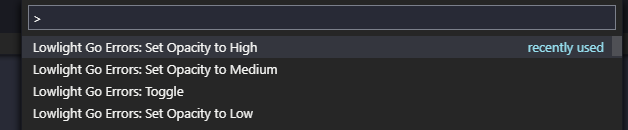

# Lowlight Go Errors

In Golang, error checks in the code make it difficult to read the code.

The **Lowlight Go Errors** extension will change the opacity of if clauses which checking errors in golang.

## Commands

`lowlightgoerrors.LowOpacity`
This command sets the current opacity to low.

`lowlightgoerrors.MediumOpacity`
This command sets the current opacity to medium.

`lowlightgoerrors.HighOpacity`
This command sets the current opacity to high.

`lowlightgoerrors.Toggle`
This command switches between low and high levels. 

## Configuration
This extension can be configured in User Settings or Workspace settings.

`lowlightgoerrors.Enabled : true`
This setting can be used to turn the plugin on and off.

`lowlightgoerrors.LowOpacity : "0.1"`
`lowlightgoerrors.MediumOpacity : "0.5"`
`lowlightgoerrors.HighOpacity : 1`
You can change the opacity values using these settings.

`lowlightgoerrors.DefaultOpacity : "Medium"`
You can choose which opacity you want when vscode is first opened.