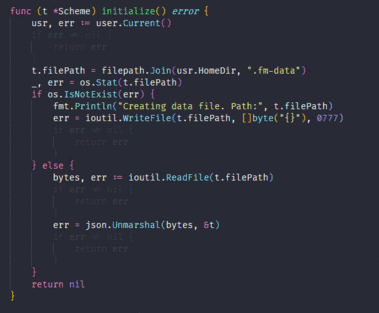

# Lowlight Go Errors

In Golang, error checks in the code make it difficult to read the code.

The **Lowlight Go Errors** extension will change the opacity(also change colors after Update 1.1.0) of if clauses which checking errors in golang.

## Commands

`lowlightgoerrors.LowOpacity` sets the current opacity to low.

`lowlightgoerrors.MediumOpacity` sets the current opacity to medium.

`lowlightgoerrors.HighOpacity` sets the current opacity to high.

`lowlightgoerrors.Toggle` switches between low and high levels. 

## Configuration
This extension can be configured in User Settings or Workspace settings.

`lowlightgoerrors.Enabled : true` turns the plugin on and off  
`lowlightgoerrors.LowOpacity : "0.1"` changes low opacity value  
`lowlightgoerrors.MediumOpacity : "0.5"` changes medium opacity value  
`lowlightgoerrors.HighOpacity : 1` changes high opacity value  
`lowlightgoerrors.DefaultOpacity : "Medium"` which opacity you want when vscode is first opened  
`lowlightgoerrors.LowlightInlineErrors : "false"` lowlight inline errors